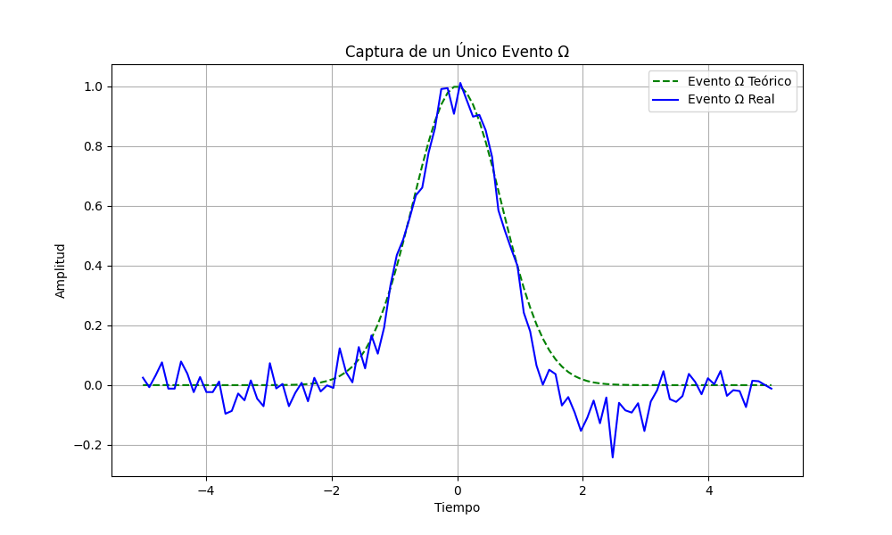
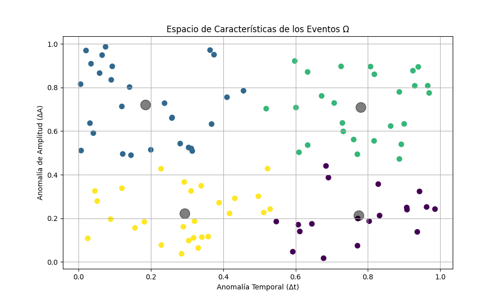

# 01. Capturing and Quantifying Omega Events

This document details the initial conceptual steps for observing and quantifying the individual "Omega (Ω) events" that define a second within the MODELO DE ACCION ESTRUCTURAL (MAE) framework.

The goal is to move beyond simply counting these events and instead extract their inherent "anomalies" – deviations from an ideal, theoretical event – to build a symbolic alphabet of these imperfections.

## 1.1 Capture of a Single Omega Event

The first step involves capturing the waveform of a single Ω event. While a theoretical "perfect" event follows an ideal curve (e.g., a Gaussian), real-world captured events exhibit noise and subtle imperfections. These imperfections are treated not as errors, but as valuable information.

*Figure 1: Simulation illustrating the capture of a single Ω event. The dashed green line represents the theoretical "perfect" event, while the solid blue line represents a real, captured event with inherent noise and subtle anomalies.*

## 1.2 Extraction and Classification of Anomalies

Once an event is captured, the Actuador de Inferencia Estructural (AIE) quantifies its imperfections. This involves:

1.  **Comparison and Residues:** Aligning the captured event with the theoretical ideal and calculating the difference (the "residue").
2.  **Feature Extraction:** From this residue, key interpretable features are extracted, such as:
    *   **Temporal Anomaly (Δt):** How much the peak of the event deviates in time from the expected.
    *   **Amplitude Anomaly (ΔA):** How much the event's intensity deviates from the normal.
    *   **Symmetry/Width Anomaly (Σ):** How the shape or width of the curve deviates.
3.  **Quantization and Symbolization (Clustering):** The AIE then classifies these events into distinct "types" of anomalies using clustering algorithms (e.g., K-Means). This creates a symbolic alphabet for the deviations. For example, events might be classified as `Ω(Anomalia_Ancho_+)` for a wider-than-normal event, or `Ω(Anomalia_Temporal_-)` for an event that occurred slightly early.

*Figure 2: Conceptual feature space of Ω events, showing how captured events (represented by dots) are classified into different "Types of Anomaly" (colors) based on their Temporal Anomaly (Δt) and Amplitude Anomaly (ΔA). This forms the symbolic alphabet for the structural analysis.*

This process transforms the raw event data into a sequence of symbols, allowing the AIE to analyze the inherent "grammar" and patterns within the stream of Ω events.
