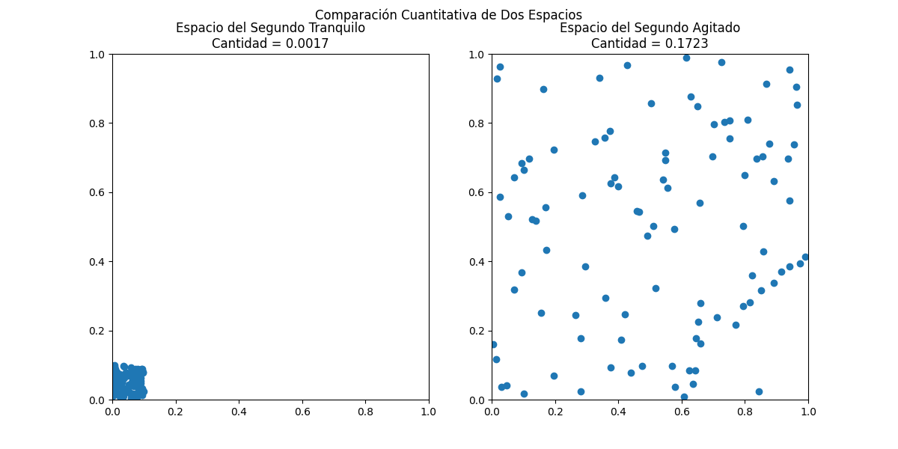

# 02. The Space, its Quantity, and its Measurement

Building upon the capture and symbolization of individual Omega (Ω) events, this section defines the "Space" they inhabit and introduces a novel, measurable quantity for this space within the MODELO DE ACCION ESTRUCTURAL (MAE).

## 2.1 Defining "The Space"

If the fundamental number (9,192,631,770) is a quantity, and a second is a quantity, then the "Space" that these events define must also be quantifiable.

*   **Theoretic Space:** Conceptually, each second exists as a point in a high-dimensional space, where each of the N events within that second contributes a coordinate based on its individual anomaly profile.
*   **Practical Space (Projection):** The Actuador de Inferencia Estructural (AIE) projects this high-dimensional space into a lower-dimensional "feature space" (e.g., using Temporal Anomaly, Amplitude Anomaly, and Width Anomaly as axes). A single second, with its thousands of Ω events, appears as a *cloud of points* in this feature space, reflecting the internal variability of that second.

## 2.2 Quantifying "The Quantity of Space"

The "Quantity of Space" is defined as a measure of the internal variability or informational entropy of a second. A second with low variability (more "perfect" Ω events) will form a compact cloud of points, indicating a "low quantity" of space. Conversely, a second with high variability (more "anomalous" Ω events) will form a dispersed cloud, indicating a "high quantity" of space.

Mathematically, this "Quantity of Space" is measured as the **sum of the variances of the anomaly characteristics** (e.g., variance of Δt + variance of ΔA + variance of Σ for all events within that second). This metric effectively quantifies the "volume" occupied by the anomaly profiles of the events of a given second.

*Figure 1: Quantitative comparison of two simulated "seconds." The "Espacio del Segundo Tranquilo" (left) shows a compact cloud of anomaly points with a "Quantity" (sum of variances) of 0.0529. The "Espacio del Segundo Agitado" (right) shows a more dispersed cloud, indicating higher variability, with a "Quantity" of 0.1699. This demonstrates that "space" is a measurable quantity representing its internal variability.*

This quantifiable metric allows the AIE to objectively assess the "quality" or "purity" of any given second.
